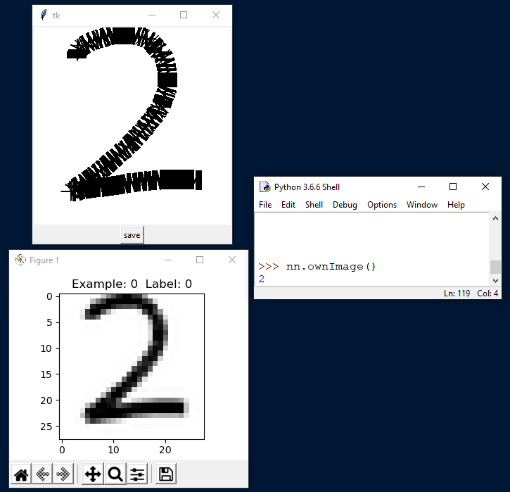

# Neural Networks from Scratch in Python

Building it from scratch: Feedforward neural networks using only NumPy!

This was my "Facharbeit" for my cs honours class in eleventh grade.

**Table of contents**
- [Neural Networks from Scratch in Python](#neural-networks-from-scratch-in-python)
  - [Dependencies](#dependencies)
  - [Results](#results)
  - [Implementation](#implementation)
    - [Code structure](#code-structure)
    - [Demonstration](#demonstration)
    - [Classify your own drawings!](#classify-your-own-drawings)
  - [Paper](#paper)
    - [Facharbeit (student version of a research paper)](#facharbeit-student-version-of-a-research-paper)
    - [Recognition](#recognition)

---

## Dependencies
If you want to run the python scripts you will need:
- Python > 3.6
- NumPy > 1.17.2
- Matplotlib > 3.0.2

---

## Results
My implementation was able to achieve results identical
to a similar neural network written in TensorFlow on the MNIST-dataset.
An exemplary neural network achieved a test-accuracy of 95.16% on MNIST after being trained for one epoch.

---
## Implementation

### Code structure
main.py contains the implementation, as well as a small demonstration
of the key functions at the bottom. The functions and methods are
all commented. The implementation includes all
necessary components required for training a neural network,
such as an activation function as well as an implementation of both
a feedforward method and the backpropagation algorithm.

### Demonstration
To run the demonstration example, please download the .csv-file
of the MNIST dataset from [this](https://www.python-course.eu/neural_network_mnist.php) website
(see "Reading the MNIST data set") and place the files into the MNIST_data_csv-folder and run
csvToPklMNIST.py.

### Classify your own drawings!
You can also draw your own image and let the neural network predict it!
For this you need to run the demonstration example and afterwards execute
the "ownImage" function of the neural network class like this:
"network.ownImage()". A pop-up-window should appear in which you can draw
your own digit. Then you can press the button and the prediction will be
written to the console.
Here is an example. In the top left you can see the drawing window and in the bottom left how the image looks when passed into the network. On the right you can see the classification result.

For the image-drawing functionality I modified source code which I originally found [here](https://stackoverflow.com/questions/52146562/python-tkinter-paint-how-to-paint-smoothly-and-save-images-with-a-different).

---
## Paper

### Facharbeit (student paper)
In my Facharbeit I analyzed the mathematical foundations
of a neural network and first came up with a "naive" implementation.
Then I optimized my first approach and discussed a more efficient
implementation, which performed significantly faster.
I analyzed a variety of network topologies and hyperparameter configurations
to draw abstract conclusions as well as compare the performance of my implementation with TensorFlow.
The paper sadly is only available in German.

### Recognition
The Facharbeit received the Dr.Hans-Riegel award (see [here](https://www.hans-riegel-fachpreise.com/ausgezeichnete-arbeiten/details?tx_alumni_pi1%5Baction%5D=show&tx_alumni_pi1%5Bcontroller%5D=Paper&tx_alumni_pi1%5Bpaper%5D=72&cHash=83f0fa07cd5de353c2df91f2010bbc5b) for
outstanding scientific work ("herausragende wissenschaftliche Arbeit") in 2019.
It ranked 2nd place in computer science at the corresponding contest at the
Johannes Gutenberg University in Mainz, which represented the state of Rheinland-Pfalz.

